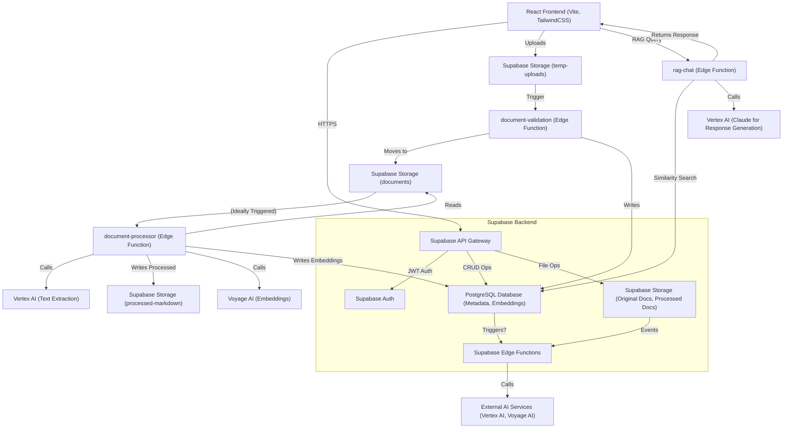

# System Architecture

## 1. Overview

This document outlines the architecture of the Legal Document Management System, a platform designed for AI-powered legal document research and compliance. It features a React frontend and a Supabase backend, emphasizing document integrity, versioning, and metadata-driven RAG (Retrieval-Augmented Generation) capabilities.

**Core Goals:**

*   Provide a secure and reliable repository for legal documents.
*   Ensure document uniqueness through content-based deduplication.
*   Support structured metadata tagging for advanced filtering and AI agent interaction.
*   Enable efficient RAG workflows for legal research by processing documents into AI-friendly formats.

## 2. Architectural Principles

*   **Modularity:** Separation of concerns between frontend, backend, and AI processing services.
*   **Scalability:** Leveraging Supabase for backend services to handle growing data and user load.
*   **Maintainability:** Clear code structure, comprehensive documentation, and consistent development patterns.
*   **Security:** Robust authentication, authorization (RLS), and data validation at all layers.
*   **AI-Readiness:** Processing and structuring documents specifically for optimal use by RAG models.

## 3. High-Level System Diagram (Conceptual)



*(Note: Mermaid diagram requires a renderer to view. This represents the conceptual flow.)*

## 4. Frontend Architecture

*   **Framework:** React 19.1.0 with TypeScript 5.8.3 for a type-safe, component-based UI.
*   **Build Tool:** Vite 6.3.5 for a fast development experience and optimized builds.
*   **Routing:** React Router 7.6.0 for client-side navigation.
*   **Styling:** Tailwind CSS 4.1.7, a utility-first CSS framework for rapid and consistent UI development. Custom configurations include an extended color palette and component abstractions using `@layer`.
*   **State Management:** Primarily React Context API for global state (e.g., authentication status, user information). Local component state is managed using React's `useState` and `useReducer` hooks.
*   **API Communication:** Supabase JS Client (v2.49.4) for all interactions with the Supabase backend (Auth, Database, Storage, Functions invocation).
*   **Key Libraries:** No major external UI component libraries post-migration from Chakra UI.
*   **Folder Structure (Illustrative - from `README.md`):
    ```
    frontend/
    ├── src/
    │   ├── components/      # Reusable UI components
    │   ├── pages/           # Page components (routes)
    │   ├── services/        # API communication (e.g., Supabase client interactions)
    │   ├── hooks/           # Custom React hooks
    │   ├── layouts/         # Page layout structures
    │   ├── contexts/        # React Context providers
    │   └── types/           # TypeScript definitions
    ├── package.json
    └── vite.config.ts
    ```

## 5. Backend Architecture (Supabase)

Supabase provides the core backend services:

*   **Authentication (`Supabase Auth`):** Manages user registration, login, and session management using email/password. JWTs are issued to authenticated users.
*   **Database (`PostgreSQL`):** Stores all structured data:
    *   Document metadata (filename, type, jurisdiction, content hash, versions).
    *   Processed document information (e.g., markdown content, links to originals).
    *   Document embeddings (vectors generated by Voyage AI).
    *   Chat conversation history.
    *   User roles and permissions.
    *   Relies heavily on Row Level Security (RLS) for data access control based on user identity and roles.
*   **Storage (`Supabase Storage`):** Stores file blobs:
    *   `documents`: Original uploaded legal documents.
    *   `temp-uploads`: Staging area for files during the upload/validation process.
    *   `processed-markdown`: (Proposed) Markdown versions of documents, optimized for RAG.
    *   `archive`: (Planned/Existing) Previous versions of documents.
*   **Edge Functions (`Deno Runtime`):** Server-side TypeScript functions for business logic, integrations, and tasks that shouldn't run client-side.
    *   Key functions include: `document-validation`, `document-processor`, `rag-chat`.
    *   Used for: file validation, deduplication, AI service integration (text extraction, embedding, LLM calls), complex queries, and secure operations.
    *   Can be triggered by HTTP requests (from frontend or webhooks) or database/storage events (though trigger setup for storage events needs verification/fixing per `tasklist.md`).
*   **API Gateway:** All Supabase services are accessed via a unified RESTful and WebSocket API gateway. The Supabase JS client abstracts these interactions.

## 6. Key Design Decisions & Rationale

*   **Hybrid Document Storage:** Original files in Supabase Storage, metadata in PostgreSQL. This optimizes for both efficient file delivery and fast querying of metadata.
*   **Content-Based Deduplication:** SHA-256 hashing of file content during upload to prevent duplicate documents, ensuring knowledge base integrity for AI.
*   **Document Versioning:** A system for tracking document revisions, archiving previous versions (5-year retention), and allowing users to access version history. This is crucial for legal documents that change over time.
*   **Structured Metadata Tagging:** `jurisdiction`, `county`, `document_type` are key metadata fields. This enables precise filtering and is vital for the RAG system to retrieve relevant context for AI agents.
*   **AI-Optimized Processing:** The shift towards converting documents to markdown (`WORKFLOW_ANALYSIS.md`) is a key decision to improve the quality of text fed into embedding models and LLMs, compared to direct PDF text extraction which was problematic.
*   **Edge Functions for Server Logic:** Offloading tasks like AI API calls, validation, and processing to serverless functions keeps the frontend lighter and secures sensitive operations/keys.
*   **Tailwind CSS over Component Library:** Migration from Chakra UI to Tailwind CSS was done to reduce bundle size, improve performance, and gain more granular control over styling.
*   **RLS for Security:** Leveraging PostgreSQL's Row Level Security, managed via Supabase, ensures that users can only access data they are permitted to see.

## 7. Data Flow for Major Processes

### a. Document Ingestion & Processing (Ideal Flow)

1.  **Upload (Frontend):** User uploads a document via the UI.
2.  **Temporary Storage (Supabase Storage):** File is sent to a `temp-uploads` bucket.
3.  **Validation (Edge Function - `document-validation`):
    *   Triggered by the new file in `temp-uploads` (or invoked by frontend post-upload).
    *   Validates file type, size.
    *   Calculates SHA-256 hash.
    *   Checks for duplicates in the `documents` table based on hash.
    *   If valid and unique, moves file to the main `documents` bucket.
    *   Creates an initial record in the `documents` table with metadata provided by the user.
    *   (Ideally) Creates a record in `document_processing_status` indicating "pending processing".
4.  **Document Processing (Edge Function - `document-processor`):
    *   Triggered by a new entry in `documents` or `document_processing_status` (this trigger needs verification/fixing).
    *   Retrieves the original document from the `documents` bucket.
    *   **Text Extraction/Conversion:** Calls Vertex AI (or other chosen service) to convert the document (e.g., PDF) to markdown.
    *   Stores the processed markdown in a `processed-markdown` bucket (or table).
    *   Updates `document_processing_status` to "processing markdown".
    *   **Chunking:** Splits the markdown content into manageable, semantically relevant chunks.
    *   **Embedding:** Sends chunks to Voyage AI to generate vector embeddings.
    *   Stores embeddings in the `document_embeddings` table, linked to the document and chunks.
    *   Updates `document_processing_status` to "completed".

### b. RAG Chat Query

1.  **Query Submission (Frontend):** User types a question in the chat interface, optionally applying metadata filters (jurisdiction, document type).
2.  **Invocation (Edge Function - `rag-chat`):
    *   Frontend calls the `rag-chat` Edge Function with the query and filters.
3.  **Query Embedding (Edge Function - `rag-chat`):
    *   The user's query is sent to Voyage AI to generate an embedding.
4.  **Similarity Search (Edge Function - `rag-chat` & Database):
    *   The query embedding is used to search the `document_embeddings` table in PostgreSQL (using `pgvector`) for the most similar document chunks.
    *   Metadata filters (jurisdiction, document_type) are applied during this search to narrow down relevant chunks.
5.  **Context Retrieval (Edge Function - `rag-chat`):
    *   The content of the top N relevant chunks is retrieved.
    *   (Optional/Future) A reranker step could be applied here.
6.  **LLM Prompting (Edge Function - `rag-chat`):
    *   The retrieved chunks (context) and the original user query are formatted into a prompt for an LLM (e.g., Claude via Vertex AI).
7.  **Response Generation (Edge Function - `rag-chat` & Vertex AI):
    *   The prompt is sent to the LLM, which generates a response based on the provided context and its general knowledge.
8.  **Response to User (Frontend):
    *   The `rag-chat` function returns the LLM's response to the frontend.
    *   The frontend displays the response to the user.
    *   The query and response are saved in `chat_conversations` and `chat_messages` tables.

## 8. Technology Stack Summary

*   **Frontend:** React 19, TypeScript, Vite, Tailwind CSS, React Router, Supabase JS Client.
*   **Backend (PaaS):** Supabase (PostgreSQL, Auth, Storage, Edge Functions - Deno runtime).
*   **AI Services (External):**
    *   **Voyage AI:** For text embeddings (model: `voyage-3-large`).
    *   **Google Vertex AI:**
        *   For text extraction/document conversion (model: e.g., Gemini 2.5 Flash Preview for multimodal inputs, or Document AI services).
        *   For LLM response generation (model: e.g., Claude 3 Sonnet via Vertex AI).
*   **Version Control:** Git (hosted on GitHub, as per `CONTRIBUTING.md`).

## 9. Security Model Overview

*   **Authentication:** Supabase Auth (email/password, JWTs).
*   **Authorization:** PostgreSQL Row Level Security (RLS) policies are the primary mechanism. Policies restrict data access based on `auth.uid()` (user ID) and potentially custom user roles.
    *   Example: Users can only manage documents they created, or admins can manage all documents.
*   **Edge Function Security:** JWTs are verified for most Edge Functions. Sensitive API keys for external services are stored securely (e.g., Supabase secrets or environment variables accessible only to functions).
*   **File Validation:** Server-side validation of file types and sizes during upload (`document-validation` function).
*   **CORS:** Configured appropriately for secure frontend-backend communication.
*   **Input Sanitization:** Implicit through Supabase client libraries for SQL; care needed for direct inputs to external services or in function logic.

*(This document consolidates information from techstack.md, approach.md, and WORKFLOW_ANALYSIS.md, and aims to be the primary source for architectural understanding. Specific details for backend and frontend development will be further elaborated in BACKEND_GUIDE.md and FRONTEND_GUIDE.md respectively.)* 